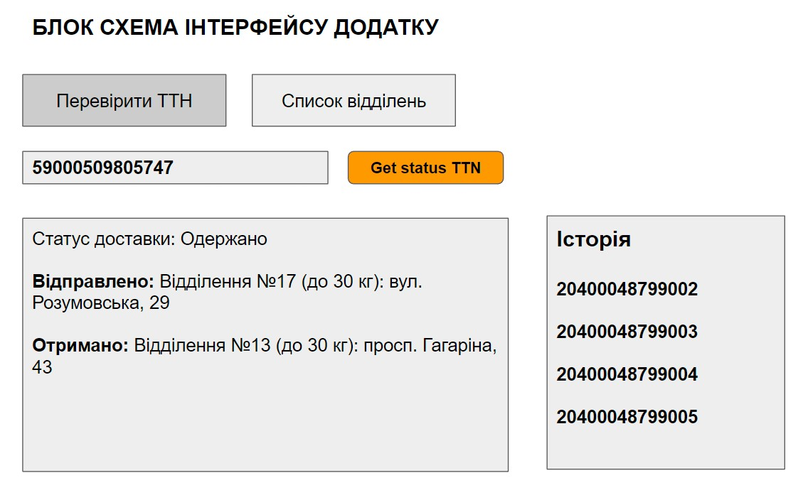
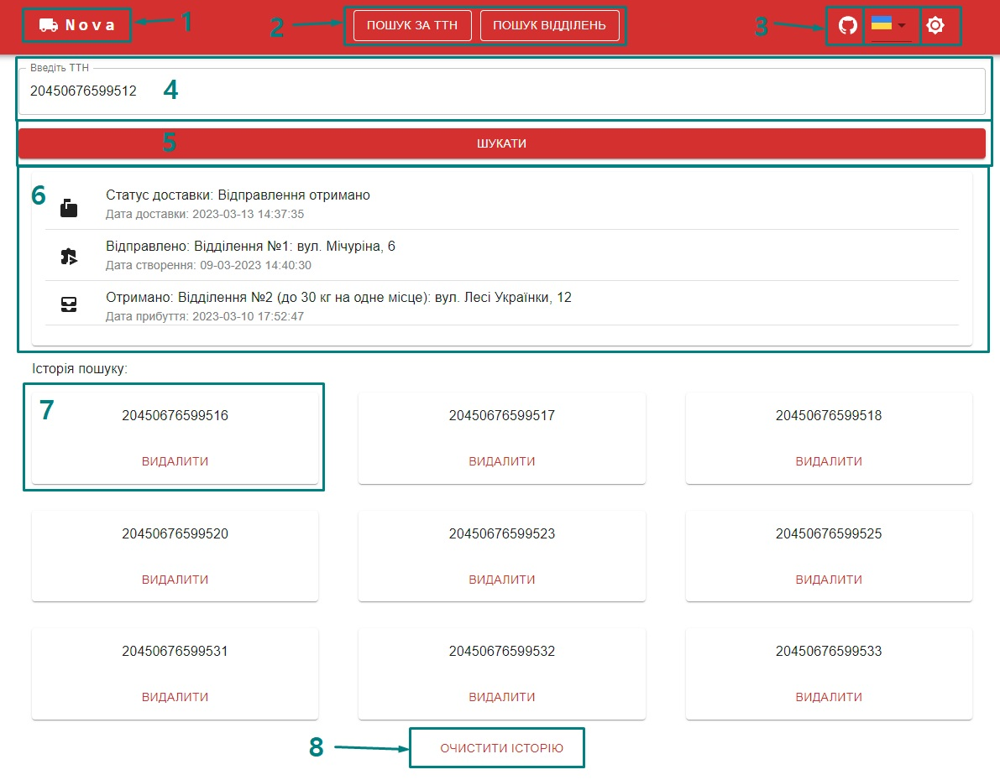
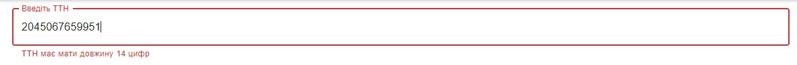
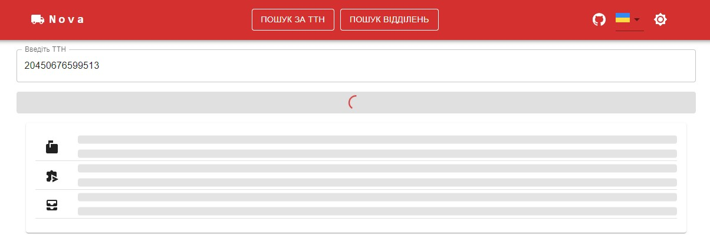
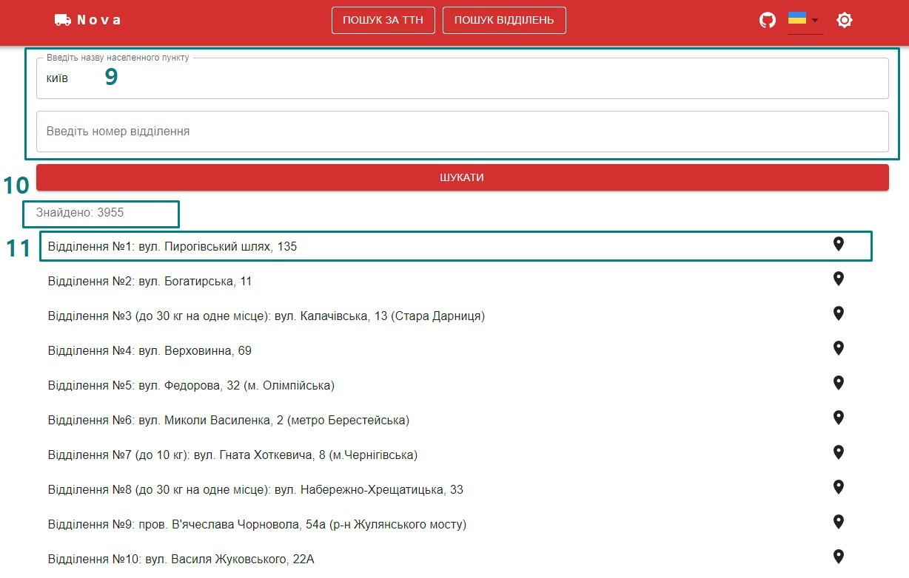
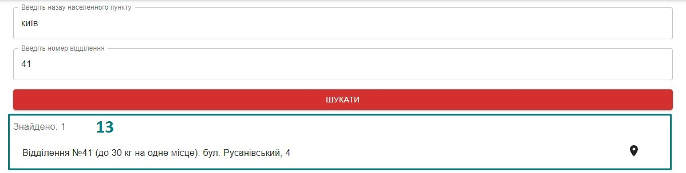
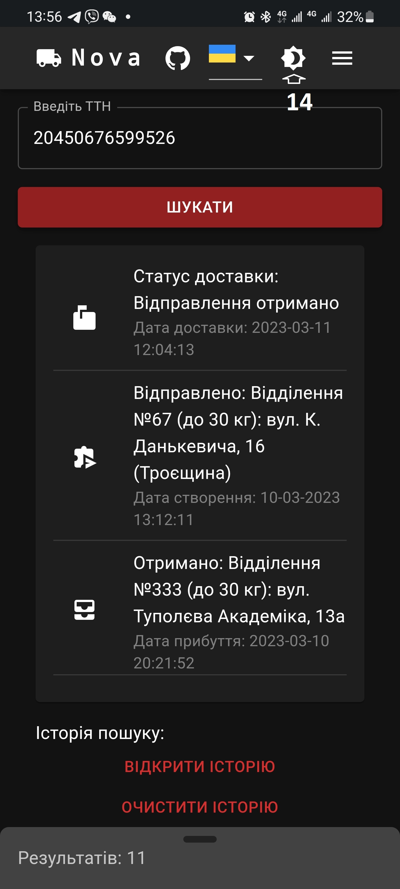
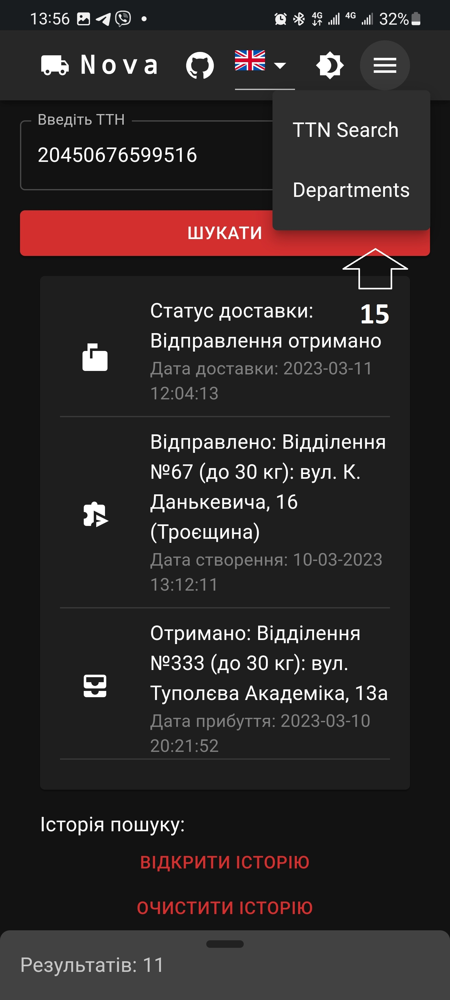
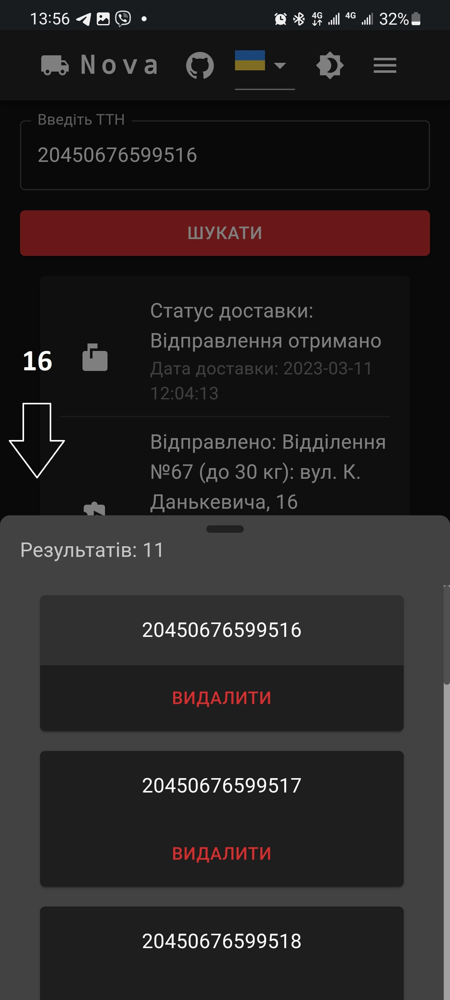

# Nova Poshta Helper

Додаток для перегляду інформації за ТТН Нової пошти та пошуку відділень.
Виконано в рамках тестового завдання на позицію JUNIOR JAVASCRIPT DEVELOPER .

## ТЗ

## ЗАВДАННЯ З РОБОТОЮ API НОВОЇ ПОШТИ

Документація API: https://developers.novaposhta.ua/documentation

Порядок роботи:

Зареєструватися на сайті Нової пошти та згенерувати ключ після входу за адресою
https://new.novaposhta.ua/dashboard/settings/developers

Знайти зі списку документації запити для пошуку актуального статусу
місцезнаходження посилки за номером накладної та отримання списку відділень
Нової пошти

Адреси для API запитів: https://api.novaposhta.ua/v2.0/json/

Для тестування запитів можна користуватися Postman або іншою схожою програмою.

ВИМОГИ ДО ФУНКЦІОНАЛУ

1. Користувач вводить номер ТТН або свій номер накладної в поле введення на
   сторінці.
2. Додаток відправляє запит на отримання даних про актуальний статус місця
   доставки товару.
3. Виводимо інформацію про відправку користувачеві.
4. Користувач повинен бачити всі попередні номери ТТН у вигляді списку в
   сайтбарі. Навіть після перезавантаження сторінки.
5. По кліку на вже доданий до списку введених номер ТТН повинен автоматично бути
   виконаний запит на статус знаходження товару (доставки) і виведена відповідна
   інформація. При цьому номер ТТН повинен автоматично відображатися в полі
   введення.
6. Номер ТТН накладної обов'язково повинен бути перевірений при введенні на
   коректність заповнення. Або засобами порівняння кожного символа з потрібним
   діапазоном кодування або регулярним виразом.
7. Повинна бути можливість очистити всі старі ТТН.
8. При невірному форматі після натискання на кнопку отримати статус доставки
   ТТН, обов'язково повинна бути показана підказка і запит відправлятися не
   повинен.
9. Переходячи на другу вкладку, користувач повинен мати можливість побачити
   список відділень Нової пошти, для чого потрібно зробити відповідний запит до
   API Нової пошти і вивести їх списком на свій розсуд.

### ТЕХНІЧНІ ЗАЛЕЖНОСТІ ПРОЕКТУ

Обов'язково створити окремий репозиторій на Git.

Крім коду на GitHub, обов'язково налаштувати публікацію ТЗ на Git Pages.

Розбити проект на підзадачі та виділяти для кожної задачі окрему гілку, на якій
буде щонайменше декілька комітів. Наприклад, створення html структури. Гілка
create-structure, коміти "Add html", “Add styles” Проект повинен бути
реалізований за допомогою React js. Використання TypeScript, Mui, Redux, Redux
ToolKit, Axios є привітним. Обов'язково подумати про стилістичне оформлення
задачі, верстка повинна бути з використанням, бути адаптивною та
кроссбраузерною. Однозначно придумати свій оригінальний зовнішній вигляд додатка
та зробити його максимально зручним для використання на екранах мобільних
пристроїв. Будь-які вдосконалення для того, щоб приховувати елементи або робити
їх більш інтерактивними на мобільному пристрої - однозначно вітаються.

### ДОДАТКОВЕ ЗАВДАННЯ

Встановити Nest JS.

Зробити так, щоб всі запроси виконувались на локальному сервері, а після - на
сервері Нової Пошти. Для цього створити Model, View, Controller.

Якщо йде перший запит на отримання даних відділень Нової пошти, зберегти
відділення в базу даних Mongo DB, а після – віддати їх як відповідь сервера. Для
наступних запитів використовувати дані з бази даних.

Реалізувати збереження даних ТТН-накладних в базу даних Mongo DB, далі повертати
дані клієнту з бази даних

Інтегрувати фронтенд React App з Node backend, таким чином, щоб фронтенд-додаток
за допомогою REST API отримував дані з бекенд додатку

## Структура та функціонал проекту

### Гілки:

1. main - Основний код додатку. Без додаткового завдання.
2. gh-pages - Гулка для побудови живої сторінки на гітхаб.
3. adding-nestjs - Гілка з частковим виконаням додаткового завдання. Окремий
   readme.md є всередині.

### Сторінки

#### Головна сторінка (пошук ТТН)

1. Назва і логотип додатку. При кліку веде на головну сторінку.
2. Нвігація по сторінкам.
3. Блок з 3 елементів: посилання на мій гітхаб, вибір мови (реалізовано для
   хедера), зміна теми.
4. Поле вводу номеру ТТН з валідацією.
   
5. Кнопка для відправки запиту при ручному вводі номера.
6. Картка інформації по ТТН. Статуси та час доствки, отримання. Реалізовано
   графічне відображення процессу завантаження.
   
7. Номера ТТН зберігаються в історію. Картки можна видали по 1 або всі разом.
8. Кнопка очищення історії.

#### Сторінка пошуку відділень

9. Форма для введеня назви міста і відділення. Назва є обов'язковою і
   обов'язково кирилицею, це валідується. Но мер відділення не є обов'язковим.
10. Загальна кількість отриманих результатів.
11. Запис з короткою інформацією та іконкою мітки, яка веде на гугл мапи.
12. Пагінація реалізована. Також вона адаптивна в залежності від типу пристрою.
13. Приклад відображення окремого відділення.
    

### Мобільна версія

14. Вигляд додатку з темною темою на мобільному пристрої.

    

15. Вигляд опциї вибору мови.

    

16. Вигляд свайп меню.

    

Примітка: частина додаткового функціоналу не описана.

## Технічна частина (англійською)

<h3>Installing</h3>

A step by step guide on how to get the development environment running.

Clone repository or get the copy in any other way.

<pre>
<code>npm i</code>
<code>npm start</code>
</pre>

<h2>Built With</h2>

<ul>
  <li><a href="https://reactjs.org/e">React</a> - The web framework used</li>
  <li><a href="https://redux.js.org/">Redux</a> - A Predictable State Container for JS Apps</li>
  <li><a href="https://redux-toolkit.js.org/">Redux Toolkit</a> - Toolset for efficient Redux development</li>
  <li><a href="https://mui.com/">MUI</a> - MUI is a massive library of UI components designers and developers can use to build React applications. The open-source project follows Google's guidelines for creating components, giving you a customizable library of foundational and advanced UI elements </li>
  <li><a href="https://axios-http.com/">Axios</a> - Axios is a promised-based HTTP client for JavaScript. It has the ability to make HTTP requests from the browser and handle the transformation of request and response data </li>
  <li><a href="https://formik.org/">Formik</a> - Formik is a small group of React components and hooks for building forms in React and React Native. It helps with the three most annoying parts: Getting values in and out of form state. Validation and error messages. Handling form submission </li>
  <li><a href="https://github.com/jquense/yup">Yup</a> - Yup is a JavaScript schema builder for value parsing and validation. Define a schema, transform a value to match, validate the shape of an existing value, or both. Yup schema is extremely expressive and allows modelling complex, interdependent validations, or value transformations. </li>
  <li><a href="https://www.i18next.com/">i18next</a> - An internationalization-framework written in and for JavaScript. But it's much more than that! i18next goes beyond just providing the standard i18n features such as (plurals, context, interpolation, format). It provides you with a complete solution to localize your product from web to mobile and desktop </li>
  <li><a href=https://github.com/notiflix/Notiflix/">notiflix</a> - Notiflix is a pure JavaScript library for client-side non-blocking notifications, popup boxes, loading indicators, and more that makes your web projects much better </li>
</ul>

<h2>Author</h2>

<ul>
  <li><strong>Frontend Developer</strong> - <a href="https://github.com/smerch88">Smerch88</a></li>
</ul>
